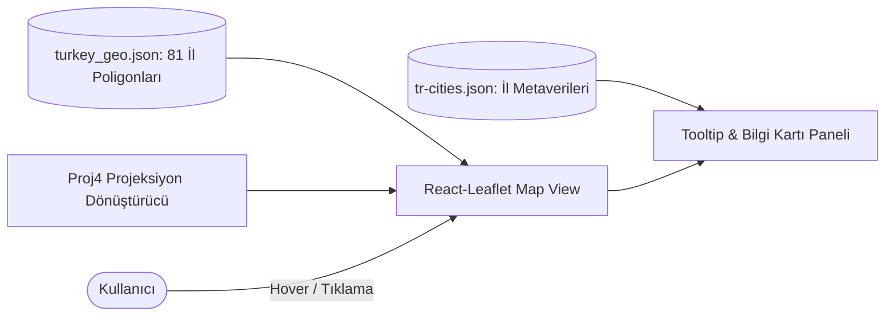

# 🗺️ Turkey Interactive GIS Map - 81 Provinces GeoJSON & Leaflet Explorer

[](https://reactjs.org/)
[](https://leafletjs.com/)
[](https://geojson.org/)
[](https://proj4js.org/)
[](https://www.yucelgumus.dev/)

> Türkiye'nin 81 ilinin coğrafi sınır poligonlarını **GeoJSON** formatında dinamik olarak harita üzerinde çizdiren, seçilen veya üzerine gelinen ili anlık olarak vurgulayan, il bazlı demografik/istatistiksel kartlar sunan ve **Proj4** ile harita projeksiyonu dönüşümlerini destekleyen modern **React & Leaflet** CBS web uygulaması.

---

## 🌟 Öne Çıkan Özellikler

- 🇹🇷 **Eksiksiz 81 İl Sınır Poligonları:** Türkiye'nin tüm illerini kapsayan hassas koordinatlı sınır veri seti (`src/turkey_geo.json`).
- 🎯 **İnteraktif Vurgulama & Hover Efektleri:** Fare ile il üzerine gelindiğinde anında renk değişimi, il adı ve plaka kodu tooltipleri.
- 🔍 **Tıklama ile Odaklanma (Click-to-Zoom):** Seçilen ilin sınırlarına göre haritayı otomatik ortalayan ve yakınlaştıran dinamik kamera motoru.
- 📐 **Proj4 ile Koordinat Dönüşümleri:** Farklı harita projeksiyon sistemleri (UTM, ED50, WGS84) arasında tarayıcı tarafında hatasız koordinat çevrimi.
- 📱 **Tam Duyarlı (Responsive) Harita Arayüzü:** Mobil ve masaüstü ekran boyutlarına otomatik uyum sağlayan Leaflet kontrolleri.

---

## 🏗️ Mimari & Coğrafi Veri Akışı



---

## 🚀 Hızlı Başlangıç

### Gereksinimler
- **Node.js**: v16.0 veya üstü

### Kurulum

```bash
git clone https://github.com/yucel-gumus/turkey-map.github.io.git
cd turkey-map.github.io

npm install
```

### Başlatma

```bash
npm start
```

Tarayıcınızda `http://localhost:3000` adresinde açılacaktır.

### GitHub Pages Dağıtımı

```bash
npm run deploy
```

---

## 📂 Proje Dizin Yapısı

```
turkey-map.github.io/
├── package.json
├── public/
└── src/
    ├── App.js                      # Ana harita konteyneri
    ├── App.css                     # Harita ve popup stilleri
    ├── turkey_geo.json             # 81 İl GeoJSON poligon verisi
    ├── tr-cities.json              # İl detayları ve plaka kodları
    └── index.js
```

---

## 📄 Lisans
Bu proje [MIT Lisansı](LICENSE) ile lisanslanmıştır.

---

## 👨‍💻 Geliştirici & İletişim

**Yücel Gümüş** - Full Stack Developer

- 🌐 **Web Sitesi / Portfolyo:** [yucelgumus.dev](https://www.yucelgumus.dev/)
- 💼 **LinkedIn:** [linkedin.com/in/yucel-gumus](https://www.linkedin.com/in/yucel-gumus/)
- 🐙 **GitHub:** [@yucel-gumus](https://github.com/yucel-gumus)

<p align="left">
  <a href="https://www.yucelgumus.dev/" target="_blank" rel="noopener noreferrer">
    
  </a>
</p>